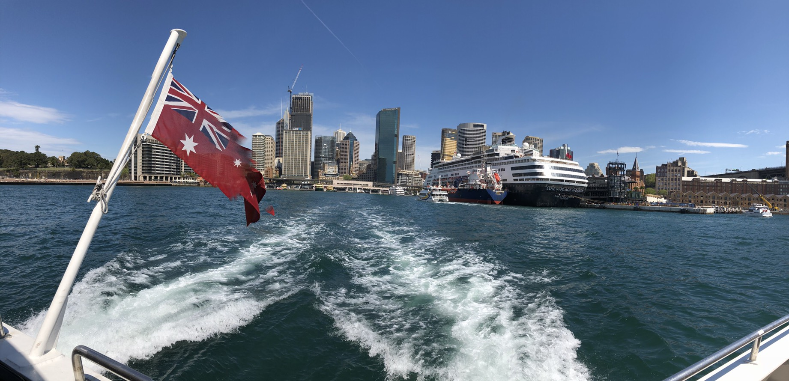
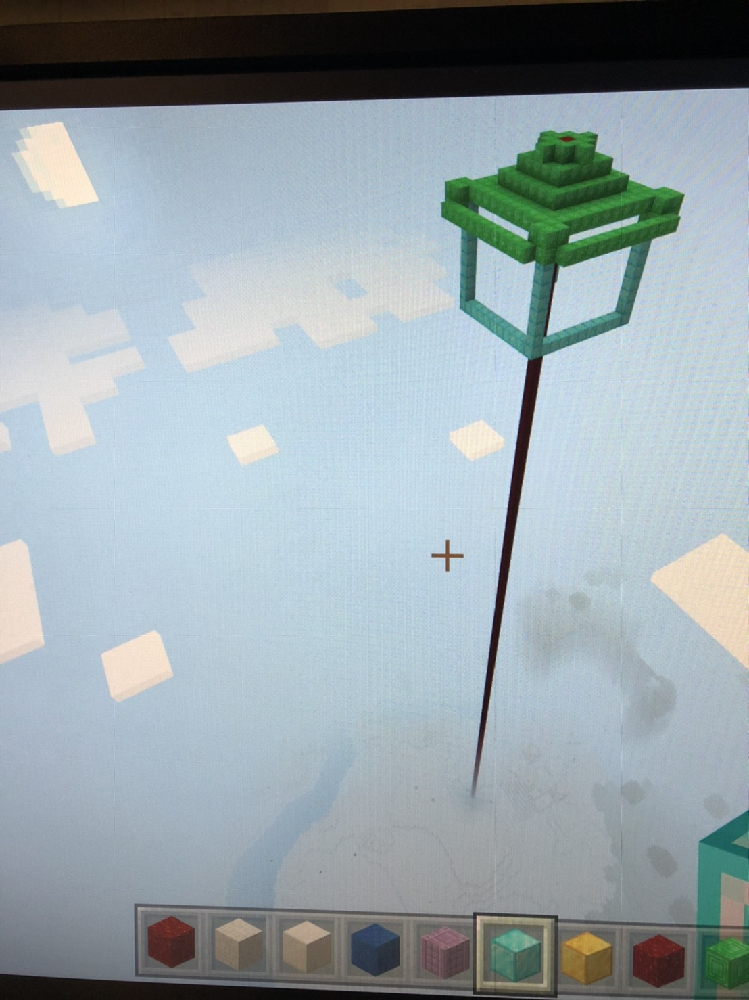

<!--  -->

# Welcome to my portfolio...

___

Hello, I'm Tanit. I like to read Chinese novels about cultivation.   

Hobbies:
* Running
* Coding
* Trading stock
* Read Novel
* Play DOTA2
* Minecraft

&nbsp;  

&nbsp;

{:.body-img}

{:.body-img}

<!-- [My Projects](https://tanitpan.github.io/projects) -->

<!-- <!DOCTYPE html>
<html lang="en">
    <head>
        <title> Tanit's Portfolio</title>
        <link href = "style.css" rel = "stylesheet">
    </head>
    <body>
        <h1>Welcome to my portfolio</h1>
        
Hello, I'm Tanit. I like to read Chinese novels about cultivation.

        
Hobbies:

        <ul>
            <li>
                Running                        
            </li>
            <li>
                Coding                
            </li>
            <li>
                Trading stock
            </li>
            <li>
                Read Novel
            </li>
            <li>
                Play DOTA2
            </li>
        </ul>
         
    </body>
</html> -->